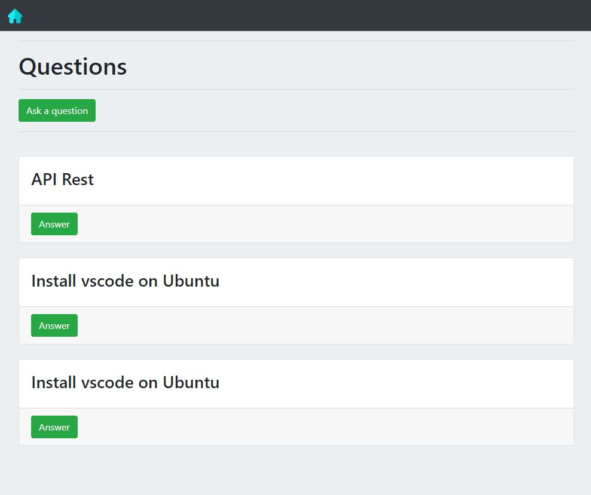

<div align="center" id="top"> 
 
  <!-- <a href="https://questionanswerplatform.netlify.com">Demo</a> -->
</div>

<h1 align="center">Question Answer Platform</h1>

<p align="center">
  

  

  

  

  <!--  -->

  <!--  -->

  <!--  -->
</p>

<!-- Status -->

<!-- <h4 align="center"> 
	🚧  Question Answer Platform 🚀 Em construção...  🚧
</h4> 

<hr> -->

<p align="center">
  <a href="#dart-sobre">Sobre</a> &#xa0; | &#xa0; 
  <a href="#sparkles-funcionalidades">Funcionalidades</a> &#xa0; | &#xa0;
  <a href="#rocket-tecnologias">Tecnologias</a> &#xa0; | &#xa0;
  <a href="#white_check_mark-pré-requesitos">Pré requisitos</a> &#xa0; | &#xa0;
  <a href="#checkered_flag-começando">Começando</a> &#xa0; | &#xa0;
  <a href="#memo-licença">Licença</a> &#xa0; | &#xa0;
  <a href="https://github.com/jennyffermorais" target="_blank">Autora</a>
</p>

<br>

## :dart: Sobre ##

Plataforma de perguntas e respostas desenvolvido com o intuito de praticar e aplicar conceitos de NodeJS. O banco de dados utilizado foi o Mysql.

## :sparkles: Funcionalidades ##

:heavy_check_mark: Exibição das perguntas cadastradas na plataforma;\
:heavy_check_mark: Inserção de nova pergunta;\
:heavy_check_mark: Inserção de resposta à uma das perguntas cadastradas;\
:heavy_check_mark: Exibição das respostas cadastradas na plataforma;\
:heavy_check_mark: Inserção de perguntas e respostas no Banco de Dados;

## :rocket: Tecnologias ##

As seguintes ferramentas foram usadas na construção do projeto:

- [EJS](https://ejs.co/)
- [Node.js](https://nodejs.org/en/)
- [Bootstrap](https://getbootstrap.com/)

## :white_check_mark: Pré requisitos ##

Antes de começar :checkered_flag:, você precisa ter o [Git](https://git-scm.com) e o [Node](https://nodejs.org/en/) instalados em sua maquina.

## :checkered_flag: Começando ##

```bash
# Clone este repositório
$ git clone https://github.com/jennyffermorais/question-answer-platform

# Entre na pasta
$ cd question-answer-platform

# Instale as dependências
$ npm install

# Para iniciar o projeto
$ npm start

# O app vai inicializar em <http://localhost:3300>
```

## :memo: Licença ##

Este projeto está sob licença MIT. 

## 💻 Ilustração do projeto ##



Feito com :heart: por <a href="https://github.com/jennyffermorais" target="_blank">Jennyffer de Morais</a>

&#xa0;

<a href="#top">Voltar para o topo</a>
